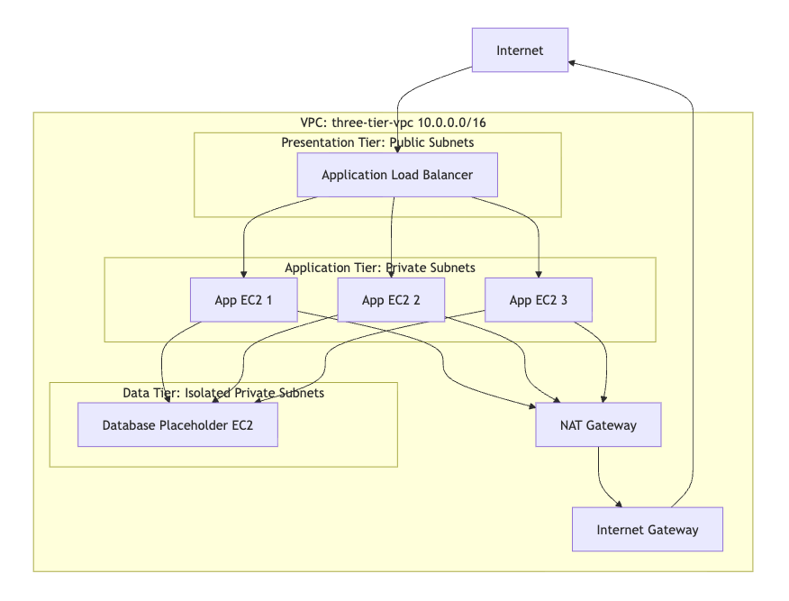
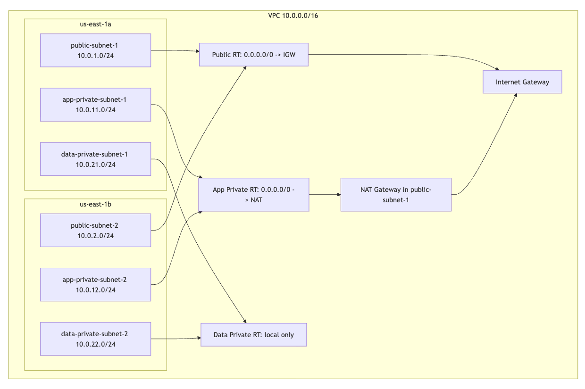
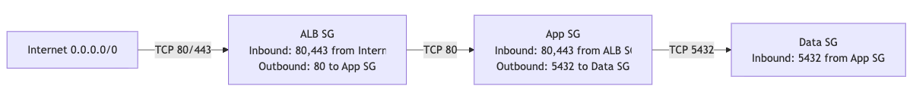
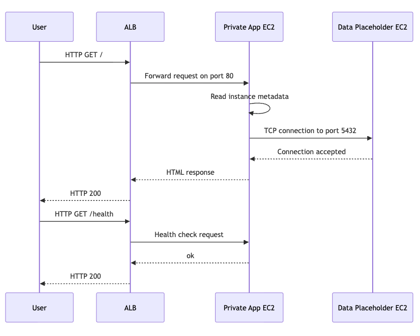

# Three Tier Architecture on AWS

This project provisions a three tier AWS architecture using Terraform.
It is designed to focuses on clear network separation, least privilege security groups, and repeatable deployment.

The stack includes:

- Presentation tier: internet facing Application Load Balancer
- Application tier: private EC2 instances running a small status web application
- Data tier: isolated private EC2 database placeholder
- Network foundation: VPC, six subnets, route tables, Internet Gateway, and NAT Gateway

## Architecture Description

The architecture uses one VPC named `three-tier-vpc` with CIDR block
`10.0.0.0/16`. It spans two Availability Zones: `us-east-1a` and `us-east-1b`.

Each tier has dedicated subnets:

- Public subnets for the load balancer
- Private application subnets for EC2 app instances
- Private data subnets for the database placeholder

Traffic enters through the Application Load Balancer on port `80`. The ALB
forwards requests to private application instances. Application instances can
connect to the data tier on port `5432`. The data tier has no default route to
the internet.

Diagrams are stored in [architecture/](architecture/).

## Diagrams

### Main Architecture



---

### Network



---

### Security Groups



---

### Traffic Flow



## How to Deploy

From the project root:

```bash
cd terraform
terraform init
terraform fmt
terraform validate
terraform plan
terraform apply
```

After deployment, get the load balancer DNS name:

```bash
terraform output alb_dns_name
```

Open the application:

```text
http://app-alb-1196878497.us-east-1.elb.amazonaws.com
```

Destroy the environment after testing:

```bash
terraform destroy
```

## Testing Instructions

1. Run `terraform validate`.
2. Run `terraform plan` and confirm the expected resources are created.
3. Run `terraform apply`.
4. Open the ALB DNS name in a browser.
5. Confirm the response includes:
   - instance ID
   - private IP address
   - Availability Zone
   - database connection status
   - health check path
6. Test the health endpoint:

```bash
curl http://<alb_dns_name>/health
```

Expected response:

```text
ok
```

Additional testing documentation is in [tests/](tests/).

## Project Structure

```text
.
├── ARCHITECTURE.md
├── COSTS.md
├── IMPROVEMENTS.md
├── README.md
├── SECURITY.md
├── app/
├── architecture/
├── config/
├── terraform/
└── tests/
```

## Notes

This project uses a single NAT Gateway for simplicity and cost control. In a
production architecture, one NAT Gateway per Availability Zone is usually better
for high availability, but it costs more.
